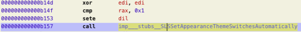
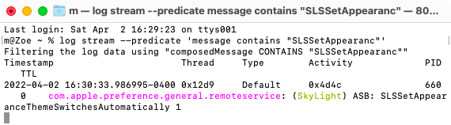
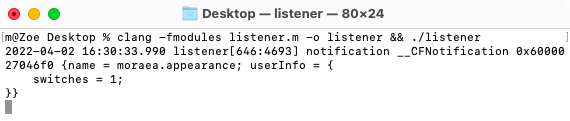

good afternoon Moraeans and welcome to Amy's hacking tutorial 😎

## Appearance.prefPane
you already did this but i didn't yet

`[AppearanceSelectorController appearance:]`



based on the calling convention (see the tips wiki) we see this is equivalent to `SLSSetAppearanceThemeSwitchesAutomatically(edi)` and edi is getting zeroed (by xor with itself) and then conditionally set. rax doesn't get checked after the call so we can assume it returns void.

## shims starting point
add `#import "hackingtutorial.m"` to the main SL shim and make that file

```objc
void SLSSetAppearanceThemeSwitchesAutomatically(int edi)
{
	trace(@"SLSSetAppearanceThemeSwitchesAutomatically %d",edi);
}
```

build and install



it works

## notification
need to get this information from System Preferences to the WindowServer or our daemon or something

attempt with [NSDistributedNotificationCenter](https://developer.apple.com/documentation/foundation/nsdistributednotificationcenter) because it looks easy!

in the shim
```objc
[NSDistributedNotificationCenter.defaultCenter postNotificationName:@"moraea.appearance" object:nil userInfo:@{@"switches":[NSNumber numberWithInt:edi]}];
```

and the listener
```objc
@import Foundation;

int main()
{
	[NSDistributedNotificationCenter.defaultCenter addObserverForName:@"moraea.appearance" object:nil queue:nil usingBlock:^(NSNotification* note)
	{
		NSLog(@"notification %@",note);
	}];
	
	CFRunLoopRun();
}
```



it works

## now time for you guys to do all the annoying work :)